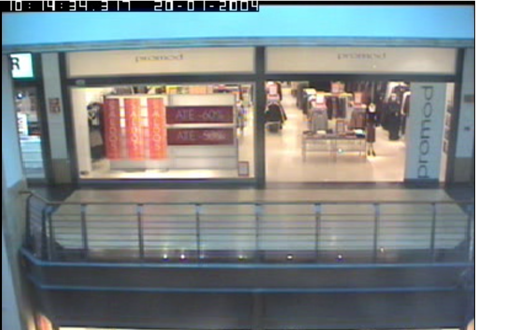

# AIVA_2021_Detecci-n_de_actividad_grupo_F
Proyecto para la asignatura de Aplicaciones Industriales y comerciales del MUVA

#  GROUP F Detection
En este repositorio se irá desarrollando la aplicación de detección de posibles clientes de una tienda y la detección de las personas que finalmente acaban pasando a la tienda, desarrollandolo con una solución aplicando vision por computador.

 
 
# AfluenceCounter
 - [Name of the application](#Name-of-the-application)
 - [Members of the development team](#Members-of-the-development-team)
 - [Teachers](#Teachers)
 - [Requirements](#Requirements)
 - [Interfaz(MOCK-UP)](#INTERFAZ(MOCK-UP))
 - [Pruebas Unitarias](#Pruebas-unitarias)
 - [Presupuesto](#Presupuesto)

## Name of the application ##
AfluenceCounter

## Members of the development team ##
| Name | Mail | GitHub |
| ---- | ---- | ------ |
| Israel Peñalver Sánchez | i.penalver.2016@alumnos.urjc.es | [IsraelSonseca](https://github.com/IsraelSonseca) |
| David Vallares Vigara |	d.valladaresv@alumnos.urjc.es |	[dvalladaresv](https://github.com/dvalladaresv) |
| Ales Darío Cevallos Juárez |	ad.cevallos@alumnos.urjc.es |	[AlexCeval](https://github.com/AlexCeval) |

## Teachers ##
| Name | Mail | GitHub |
| ---- | ---- | ------ |
| José Francisco Vélez Serrano | jose.velez@urjc.es | [jfvelezserrano](https://github.com/jfvelezserrano) |

## Requirements ##
[DocumentodeRequisitos](./doc/Enunciado_P1-editado.pdf)

## INTERFAZ(MOCK-UP) ##
[Interfaz](./mock-up/mockup.pdf)

## PRUEBAS UNITARIAS ##
[Pruebas UNITARIAS](./code)

## Presupuesto ##
[Presupuesto](./docs/presupuesto_proyecto.pdf)
