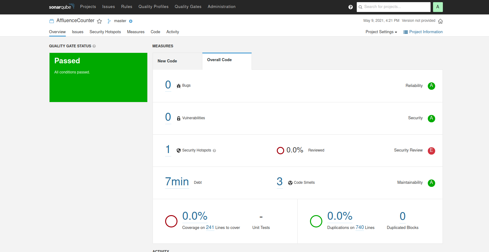

# AIVA_2021_Deteccion_de_actividad_grupo_F
Proyecto para la asignatura de Aplicaciones Industriales y comerciales del MUVA

#  GROUP F Detection
En este repositorio se irá desarrollando la aplicación de detección de posibles clientes de una tienda y la detección de las personas que finalmente acaban pasando a la tienda, desarrollandolo con una solución aplicando vision por computador.

 
 
# AfluenceCounter
 - [Nombre de la aplicación](#Nombre-de-la-aplicación)
 - [Equipo de Desarrollo](#Equipo-de-Desarrollo)
 - [Profesores](#Profesores)
 - [Documentación de Requisitos](#Documentación-de-Requisitos)
 - [Presupuesto](#Presupuesto)
 - [Interfaz(MOCK-UP)](#Interfaz(MOCK-UP))
 - [Documento de diseño](#Documento-de-diseño)
 - [Documento del sistema](#Documento-del-sistema)
 - [Ejecución de la aplicación](#Ejecución-de-la-aplicación)
 - [Despliegue](#Despliegue)  
 - [Testing](#Testing)
 - [Métricas sobre el sistema](#Métricas-sobre-el-sistema)
 - [Presentación al cliente](#Presentacion-al-cliente)

## Nombre de la aplicación ##
AfluenceCounter

## Equipo de Desarrollo ##
| Name | Mail | GitHub |
| ---- | ---- | ------ |
| Israel Peñalver Sánchez | i.penalver.2016@alumnos.urjc.es | [IsraelSonseca](https://github.com/IsraelSonseca) |
| David Valladares Vigara |	d.valladaresv@alumnos.urjc.es |	[dvalladaresv](https://github.com/dvalladaresv) |
| Ales Darío Cevallos Juárez |	ad.cevallos@alumnos.urjc.es |	[AlexCeval](https://github.com/AlexCeval) |

## Profesores ##
| Name | Mail | GitHub |
| ---- | ---- | ------ |
| José Francisco Vélez Serrano | jose.velez@urjc.es | [jfvelezserrano](https://github.com/jfvelezserrano) |

## Documentación de Requisitos ##
[Documento de Requisitos](./docs/RequisitosDRS.pdf)

## Presupuesto ##
[Presupuesto](./docs/Presupuesto.pdf)

## INTERFAZ(MOCK-UP) ##
[Interfaz](./docs/mockup.pdf)

## Documento de diseño ##
[Documento de diseño](./docs/documento_de_diseño.pdf)  

## Documento del sistema ##
[Documento del sistema](./docs/sistema_funcional.pdf)   

## Ejecución de la aplicación ##  

### Pre-requisitos    
- El proyecto se ha desarrollado utilizando la versión de python 3.8. Es necesario tener instalado [pip](https://pypi.org/project/pip/) para descargase las librerías necesarias. Se recomienda la creación de un entorno virtual para evitar problemas de dependencias, por ejemplo utilizando [virtualenv](https://virtualenv.pypa.io/en/latest/).   
- Es necesario instalarse las siguientes librerías.   
~~~
    pip install opencv-contrib-python==4.5.1.48
    pip install numpy==1.20.2
    pip install wget==3.2
~~~ 

### Descargar el repositorio
- Se recomienda utilizar la herramienta de control de versiones [git](https://git-scm.com/) para clonarse el repositorio.  
~~~
    git clone https://github.com/dvalladaresv/AIVA_2021_Deteccion_de_actividad_grupo_F.git
~~~   
- Si no desea instalarse git, puede descargarse el repositorio como un fichero comprimido .zip. 

- Para facilitar la instalación de todas las dependencias se proporciona un fichero [requirements.txt](./AffluenceCounter/requirements.txt) que se encuentra dentro del directorio *AffluenceCounter/*. Para lanzarlo dirigirse a este directorio y lanzar:
~~~
    pip install -r ./AffluenceCounter/requirements.txt
~~~
- Es necesario descargase los pesos de la red Yolo en el directorio [./AffluenceCounter/assests/model](./AffluenceCounter/assets/model/). Para ello ejecutar los siguientes comandos:
~~~ 
 cd ./AffluenceCounter/assets/model/ 
 wget https://pjreddie.com/media/files/yolov3.weights
~~~   

### Ejecución en local

- Estando en la raíz del proyecto, dirigirse al directorio *./AffluenceCounter/app/*   
~~~
    cd ./AffluenceCounter/app/
~~~

- La aplicación puede ser ejecutada mediante dos formas:
  
  - Por línea de comandos
  ~~~
    python affluence_counter.py --video_path=<path_video>  
  
    #Example
    python affluence_counter.py --video_path=../../videos/1_EnterExitCrossingPaths1front.mpg
  ~~~   
  
  - Mediante una aplicación web, lanzando el servidor y abriendo el navegador en *http://localhost:5000*
  ~~~   
        python AfluenceCounterApp.py
  ~~~   
- Video-Tutorial del funcionamiento de la aplicación    
   
  
## Despliegue ##

- Se ha desarrollado una imagen [Docker](https://www.docker.com/) con el objeto de facilitar el despliegue de la aplicación. Es necesario tener instalado docker en la máquina donde se desea realizar el despliegue.    

- Pasos a seguir para el despliegue:   
    - Descargarse la imagen docker **dvalladaresvv/aiva-affluence-counter** que se encuentra alojada en [DockerHub](https://hub.docker.com/). Para ello ejecutar:   
    ~~~
        docker pull dvalladaresvv/aiva-affluence-counter:latest
    ~~~   
  
    - Lanzar un contenedor con la imagen docker:   
    ~~~
        docker run --name AffluenceCounter -d -p 5000:5000 dvalladaresvv/aiva-affluence-counter   
    ~~~    
    - Puede visualizar que el contenedor está ejecutándose, utilizando el comando:   
    ~~~
        docker ps
    ~~~  
    - Abrir un navegador y dirigirse a *http://localhost:5000* y la aplicación estará disponible.   

- Video-Tutorial para el despliegue    

## Testing ##

- Las [pruebas unitarias](./AffluenceCounter/test) se encuentran dentro de *./AffluenceCounter/test*. El lanzamiento de un test se puede realizar por línea de comandos ejecutando:   
~~~
    python <test>.py
~~~ 

- Un ejemplo de lanzamiento sería:
~~~
   python test_detector.py
~~~
    
## Métricas sobre el sistema ##
Metricas obtenidas utilizando la aplicación [Sonarqube](https://www.sonarqube.org/)

## Presentacion al cliente ##
[Presentacion al cliente](./docs/presentacion_cliente_aiva.pdf)   
